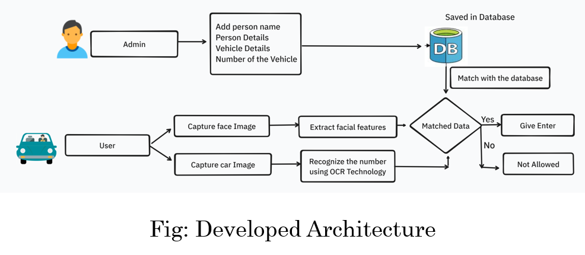
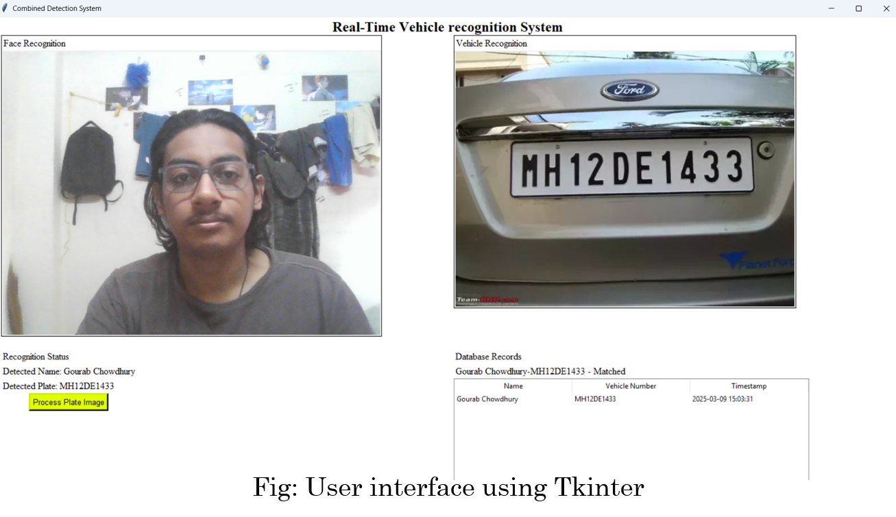
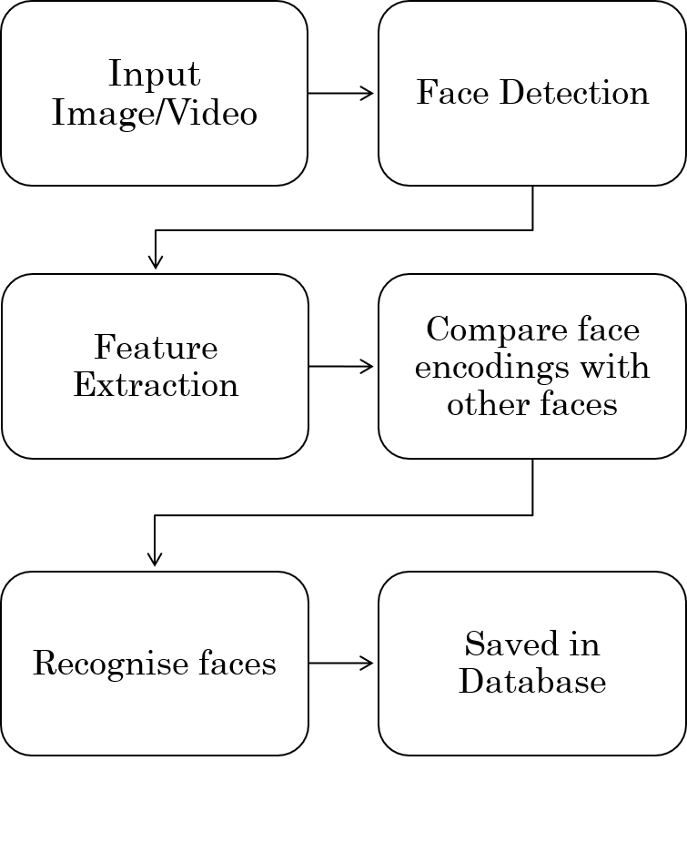
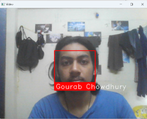
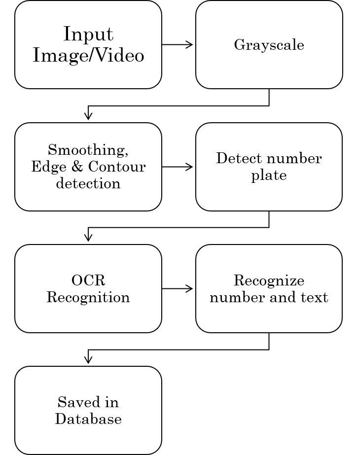
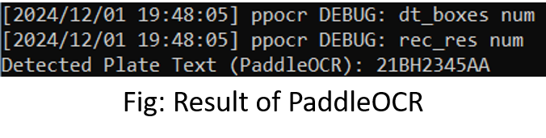
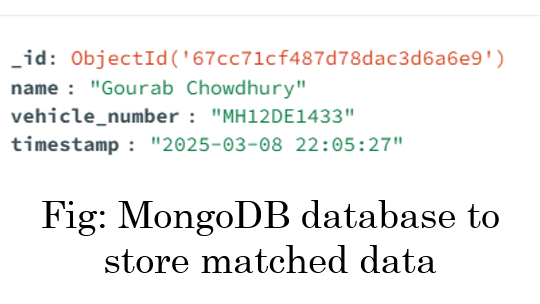

# IoT-based Smart Entrance System

## Overview
The **IoT-based Smart Entrance System** is an advanced security solution that integrates **Facial Recognition** and **Vehicle Number Plate Detection** to automate and enhance access control. This project leverages **deep learning techniques**, **OCR-based number plate recognition**, and **database integration**, ensuring highly secure and efficient authentication.

The system operates in **real-time**, making it suitable for deployment in **residential complexes, corporate offices, gated communities, and industrial facilities**. The **dual authentication mechanism** (facial and vehicle recognition) ensures only authorized personnel gain access.

## Features
- **Facial Recognition**: Uses **One Shot Learning** and deep learning-based face encodings for accurate identification.
- **Vehicle Number Plate Detection**: Utilizes `PaddleOCR` for robust text extraction from vehicle plates.
- **Database Integration**: Stores and verifies credentials using `SQLite3` (local database) and `MongoDB` (cloud storage).
- **Web Interface**: Developed using `Flask`, `HTML`, `CSS`, and `JavaScript` for real-time monitoring and data management.
<!-- - **User-Friendly GUI**: Built with `Tkinter` and `Streamlit` for local system interaction. -->
- **Automated Logging System**: Records each entry with **timestamps** for security audits.

## System Architecture
```
Admin Inputs  -->  User Entry Process  -->  Data Processing  -->  Database Matching  -->  Outcomes  -->  Logs & Monitoring
```
### **System Workflow Diagram**


### **A. Admin Inputs**
- **Admin Role**: The admin is responsible for setting up the initial database of authorized users.
- **Data Entry**: The admin inputs the person's name, vehicle details, and the vehicle's number plate into the system. This information is stored in a centralized database for future comparison during user authentication.

### **B. User Entry Process**
- The user approaches the entrance system with their vehicle.
- Two simultaneous actions occur:
  1. **Face Capture**: The system captures an image of the user’s face using a camera.
  2. **Vehicle Number Plate Capture**: Another camera captures the image of the vehicle's number plate.

### **C. Data Processing**
- **Facial Feature Extraction**: The facial recognition system extracts key facial features from the captured image and encodes them into a vector representation. These encoded features are used for comparison against the pre-stored database of authorized users.
- **Number Plate Recognition**: The system uses **Optical Character Recognition (OCR)** technology to extract the alphanumeric data (e.g., license plate number) from the captured vehicle image.

### **D. Database Matching**
- The system compares the extracted facial features and vehicle number with the entries stored in the database.
- **If a Match is Found**:
  - The user is granted access, and the system activates the entrance mechanism (e.g., opening a gate or barrier).
- **If No Match is Found**:
  - The user is denied access, and the system may trigger an alert for the admin or security personnel.

### **E. Outcomes**
#### **Matched Data**
1. The user and vehicle are authenticated successfully.
2. Access is granted, and the entrance opens for the user.

#### **Unmatched Data**
1. Either the face or the number plate fails to match with the database.
2. The system denies access and logs the event for further review.

### **System Interface**


### **Facial Recognition Algorithm**

### **Facial Recognition Workflow**



The system employs **One Shot Learning** algorithm using **dlib** and **face-recognition** libraries to ensure efficient and accurate face authentication. The process includes:
1. **Face Detection**: Uses **Histogram of Oriented Gradients (HOG)** to detect facial features.
2. **Face Encoding**: Converts detected faces into **128-dimensional feature vectors** using a deep learning-based ResNet model.
3. **Face Matching**:
   - Compares the extracted face encoding with stored database encodings using **Euclidean distance**.
   - If the distance is below **0.45**, a match is confirmed.
4. **Decision Making**: If matched, access is granted; otherwise, an alert is triggered.

### **Facial Recognition in Action**


This approach ensures **real-time processing, high accuracy, and scalability** for access control applications.

<!--### **Key Features Highlighted in the Flowchart**-->


### **Vehicle Number Plate Detection Algorithm**

### **Facial Recognition Workflow**


The system employs **PaddleOCR** and OpenCV for efficient number plate recognition:
1. **Image Preprocessing**:
   - Convert the image to grayscale.
   - Apply bilateral filtering to reduce noise while preserving edges.
   - Use Canny edge detection to highlight contours.
2. **Contour Detection**:
   - Identify all contours in the image.
   - Filter out non-rectangular shapes and select the largest ones likely to be a number plate.
3. **License Plate Localization**:
   - Detect rectangular shapes with four corners.
   - Crop the identified region containing the license plate.
4. **OCR Processing**:
   - Utilize `PaddleOCR` for text recognition.
   - Convert extracted text into a standardized format for database comparison.
5. **Database Matching**:
   - Compare the extracted text with registered vehicle numbers in the database.
   - If matched, grant access; otherwise, trigger an alert.

### **Vehicle Number Plate**


### **Vehicle Number Plate Detection**


This method ensures **accurate, real-time, and reliable recognition** of vehicle plates.

### **Key Features Highlighted in the Flowchart**
- **Admin Control**: The admin has full control over the database, ensuring only authorized individuals and vehicles gain entry.
- **Dual Authentication**: The use of both facial recognition and number plate detection provides an added layer of security.
- **Automated Workflow**: The process is fully automated, requiring minimal human intervention, improving efficiency and reducing errors.
- **Integration with IoT**: Data is stored and processed in a centralized database, allowing remote monitoring and management via IoT platforms.

## Technologies Used
- **Programming Languages**: Python, JavaScript
- **Computer Vision Libraries**: OpenCV, Dlib, face-recognition
- **OCR Engine**: PaddleOCR
- **Frontend Technologies**: HTML, CSS, JavaScript
- **Backend Framework**: Flask
- **Database Systems**: SQLite3 (local storage) and MongoDB (cloud-based logging)
<!--- **GUI Tools**: Tkinter, Streamlit-->
- **Networking**: IoT-based Wi-Fi communication for seamless data transmission


## Results & Performance
- **Facial Recognition Accuracy**: **~92%** under standard conditions.
- **Number Plate Detection Success Rate**: **~89%** across various lighting and environmental settings.
- **Real-time Processing Capability**: Flask-based backend ensures low-latency execution.
- **Database Query Time**: Optimized for fast authentication and logging.


### **Database Integration**
### **Stored data in SQLite3 database**


### **Updated MongoDB database after find matched data**


## Use Cases
The **IoT-based Smart Entrance System** can be deployed in:
- **Corporate Office Entry Gates**: Ensures only registered employees can enter premises.
- **Residential Societies**: Restricts access to authorized residents and their vehicles.
- **Parking Lots**: Automates entry based on registered vehicle number plates.
- **Industrial Security Checkpoints**: Prevents unauthorized access to restricted areas.
- **University Campuses**: Monitors staff, students, and registered visitors.

## Challenges & Future Enhancements
### **Challenges Faced**
- **Variability in Number Plate Designs**: Differences in fonts, sizes, and styles across vehicles.
- **Environmental Factors**: Low light, fog, and occlusion affecting recognition accuracy.
- **Database Scalability**: Managing a large database of faces and vehicle registrations.

### **Proposed Future Enhancements**
- **Deep Learning-Based Face Recognition**: Implement CNN-based facial recognition for higher accuracy.
- **Cloud-Based Authentication**: Use AWS or Firebase for cloud-based access control.
- **Mobile App Integration**: Develop an Android/iOS app for remote monitoring.
- **Edge AI Optimization**: Use TensorRT or OpenVINO for improved model efficiency.

## Conclusion
The **IoT-based Smart Entrance System** successfully integrates **facial recognition** and **vehicle number plate detection** to enhance security and automation at entry points. By leveraging **deep learning, OCR, and IoT frameworks**, the system provides **real-time identification** and **automated logging**, making it a **robust solution for modern access control**.

### **Key Takeaways**
✔ **Efficient Face Recognition**: Implemented using `dlib` and face encodings.

✔ **Accurate Number Plate Detection**: Powered by `PaddleOCR`.

✔ **Database Integration**: Secure credential storage using `SQLite3` and `MongoDB`.

✔ **User-Friendly Interface**: Web UI with real-time monitoring & database management.

✔ **Scalability & Adaptability**: Suitable for corporate, residential, and industrial applications.


## Author
**Gourab Chowdhury**  
Department of Electronics & Communication Engineering  
NIT Rourkela  
Supervised by **Dr. Santos Kumar Das**
